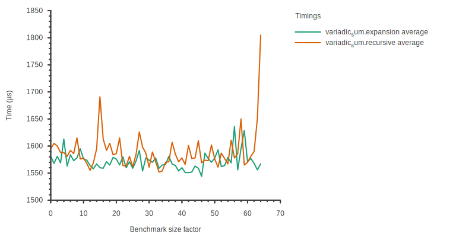
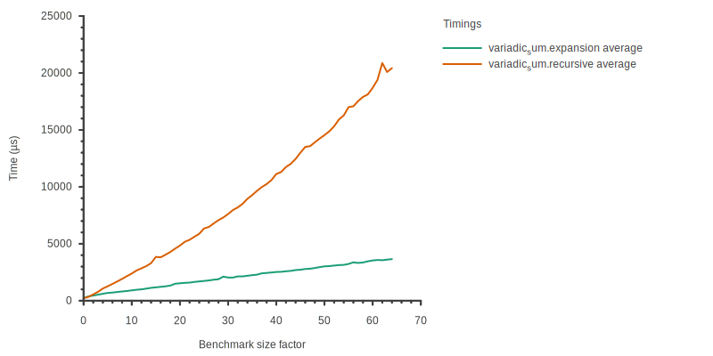

# Summary

With metaprogrammed libraries like Eigen[@eigen], Blaze[@blazelib], or
CTRE[@ctre] being developed, we're seeing increasing computing needs at compile
time. These needs might grow even larger as C++ embeds more features over time
to support and extend this kind of practices, like compile-time
containers[@more-constexpr-containers] or static reflection[@static-reflection].
However there is still no clear cut methodology to compare the performance
impact of different metaprogramming strategies. Moreover, new C++ features might
allow for new techniques that could offer better compile-time performance.
However, these claims still remain to be proven with proper methodology.

This paper introduces **ctbench**, which is a set of tools for compile-time
benchmarking and analysis in C++. It aims to provide developer-friendly tools to
declare and run benchmarks, then aggregate, filter out, and plot the data to
analyze it. As such, **ctbench** is meant to become the first layer for proper
scientific methodology for analyzing compile-time program behavior.

<!-- Plan -->

We'll first have a look at current tools for compile-time profiling and
benchmarking and establish the limits of what these tools can do.

# Statement of need

C++ template metaprogramming raised interest for allowing computing libraries to
offer great performance with a very high level of abstraction. As a tradeoff for
interpreting representations of calculations at runtime, they are represented at
compile-time, and transformed directly into their own programs.

As metaprogramming became easier with C++11 and C++17, it became more mainstream
and consequently, developers have to bear with longer compilation times without
being able to explain them. Therefore being able to measure compilation times is
increasingly important, and being able to explain them as well. A first
generation of tools aims to tackle this issue with their own specific
methodologies:

- Buildbench[@buildbench] measures compiler execution times for basic
  A-B compile-time comparisons in a web browser,
- Metabench[@metabench] instantiates variably sized benchmarks using embedded
  Ruby (ERB) templating and plots compiler execution time, allowing scaling
  analyses of metaprograms,
- Templight[@templight] adds Clang template instantiation inspection
  capabilities with debugging and profiling tools.

Additionally, Clang has a built-in profiler[@time-trace] that provides in-depth
time measurements of various compilation steps, which can be enabled by passing
the `-ftime-trace` flag. Its output contains data that can be directly linked to
symbols in the source code, making it easier to study the impact of specific
symbols on various stages of compilation. The output format is a JSON file meant
to be compatible with Chrome's flame graph visualizer, that contains a series of
time events with optional metadata like the (mangled) C++ symbol or the file
related to an event. The profiling data can then be visualized using tools such
as Google's [Perfetto UI](https://ui.perfetto.dev/).


Clang's profiler data is very exhaustive and insightful, however there is no
tooling to make sense of it in the context of variable size compile-time
benchmarks. **ctbench** tries to bridge the gap by providing a tool to analyze
this valuable data. It also improves upon existing tools by providing a solution
that's easy to integrate into existing CMake projects, and generates graphs in
various formats that are trivialy embeddable in documents like research papers,
web pages, or documentations. Additionally, relying on persistent configuration,
benchmark declaration and description files provides strong guarantees for
benchmark reproductibility, as opposed to web tools or interactive profilers.

# Functionality

Originally inspired by Metabench[@metabench], **ctbench** development was
driven by the need for a similar tool that allows the observation of Clang's
time-trace files to help get a more comprehensive view on the impact of
metaprogramming techniques on compile times. A strong emphasis was put on
developer friendliness, project integration, and component reusability.

**ctbench** provides:

- a well documented CMake API for benchmark declaration, which can be generated
  using the C++ pre-processor,

  Although CMake is not a proper programming language, it is used as the main
  API for **ctbench** as most C++ developers are already familiar with it.

- a set of JSON-configurable plotters with customizable data aggretation
  features, which can be reused as a C++ library

  The core library provides data representations to handle benchmarks cases
  instantited at several sizes, each instance being repeated at least once. It
  also provides tools to aggregate, filter, and sort data from time-trace
  events, as well as various plotters that provide different aggregation and
  vizualisation strategies. The plotters can generate files in various format
  thanks to the Sciplot[@sciplot] library, and they are highly configurable
  through JSON configuration files that are well documented. Default
  configuration files can be generated using a dedicated CLI tool.

Despite the fact that **ctbench** was made to handle Clang's time-trace events,
it can also measure compiler execution time and report it in a synthetic
time-trace file, making it partially compatible with GCC as well.

In addition to **ctbench**'s time-trace handling, it has a compatibility mode
for compilers that do not support it like GCC. This mode works by measuring
compiler execution time just like Metabench and generating a time-trace file
that contains compiler execution time. Moreover, the tooling makes defining
compilers per-target possible within a CMake project, allowing black-box
compiler performance comparisons between GCC and Clang for example or
comparisons between different versions of a compiler.

All these features make **ctbench** a very complete toolkit for compile-time
benchmarking, making comprehensive benchmark quick and easy, and the only
compile-time benchmarking tool that can gater Clang profiling data for scaling
analysis.

# Practical examples

This section will cover a short yet practical example of ctbench usage. We want
to calculate the sum of a series of integers known at compile-time, using a type
template to store unsigned integer values at compile-time.

We will be comparing the compile-time performance of two implementations:
- one based on a recursive function template,
- and one based on C++11 parameter pack expansion.

First we need to include `utility` to instantiate our benchmark according to the
size parameter with `std::make_index_sequence`, and define the compile-time
container type for an unsigned integer:

```cpp
#include <utility>

/// Compile-time std::size_t
template <std::size_t N> struct ct_uint_t {
  static constexpr std::size_t value = N;
};
```

The first version of the metaprogram based on a recursive template function:

```cpp
/// Recursive compile-time sum implementation
template<typename ... Ts> constexpr auto sum();

template <> constexpr auto sum() { return ct_uint_t<0>{}; }
template <typename T> constexpr auto sum(T const &) { return T{}; }

template <typename T, typename... Ts>
constexpr auto sum(T const &, Ts const &...tl) {
  return ct_uint_t<T::value + decltype(sum(tl...))::value>{};
}
```

And the other version relying on C++11 parameter pack expansion:

```cpp
/// Expansion compile-time sum implementation
template<typename ... Ts> constexpr auto sum();

template <> constexpr auto sum() { return ct_uint_t<0>{}; }

template <typename... Ts> constexpr auto sum(Ts const &...) {
  return ct_uint_t<(Ts::value + ... + 0)>{};
}
```

Both versions share the same interface, and thus the same driver code as well.
The driver code takes care of scaling the benchmark according to
`BENCHMARK_SIZE`, which is defined by **ctbench** through the CMake API:

```cpp
// Driver code

template <typename = void> constexpr auto foo() {
  return []<std::size_t... Is>(std::index_sequence<Is...>) {
    return sum(ct_uint_t<Is>{}...);
  }
  (std::make_index_sequence<BENCHMARK_SIZE>{});
}

[[maybe_unused]] constexpr std::size_t result =
    decltype(foo())::value;
```

The CMake code needed to run the benchmarks is the following:

```cmake
ctbench_add_benchmark(
  variadic_sum.expansion variadic_sum/expansion.cpp ${BENCHMARK_START}
  ${BENCHMARK_STOP} ${BENCHMARK_STEP} ${BENCHMARK_ITERATIONS})

ctbench_add_benchmark(
  variadic_sum.recursive variadic_sum/recursive.cpp ${BENCHMARK_START}
  ${BENCHMARK_STOP} ${BENCHMARK_STEP} ${BENCHMARK_ITERATIONS})
```

Then a graph can be declared:

```cmake
ctbench_add_graph(variadic_sum-compare-graph compare-all.json
                  variadic_sum.expansion variadic_sum.recursive)
```

with `compare-all.json` containing the following:

```json
{
  "plotter": "compare_by",
  "legend_title": "Timings",
  "x_label": "Benchmark size factor",
  "y_label": "Time (µs)",
  "draw_average": true,
  "demangle": false,
  "draw_points": false,
  "width": 800,
  "height": 400,
  "key_ptrs": ["/name", "/args/detail"],
  "value_ptr": "/dur",
  "plot_file_extensions": [".svg"]
}
```

This configuration file uses the `compare_by` plotter to generate one plot for
each pair of elements designated by the JSON pointers in `key_ptrs`, namely
`/name` and `/args/detail`. The first pointer designates an LLVM timer for a
particular section of code, and the second *may* refer to a C++ symbol, or a
C++ source filename.

The result is a series of graphs, each one designating a particular timer event,
specific to a source or a symbol whenever it is possible (ie. whenever
additional data is present in the `/args/detail` value of a timer event). Each
graph compares the evolution of these timer events in function of the
instanciation size of the benchmark cases.

{width=100%}

The first timer we want to look at is ExecuteCompiler, which is the total
compilation time. This is by far the more important metric as it is the most
comprehensive one, and can be interpreted

{width=100%}

{width=100%}

The backend is not being impacted here, supposedly because increasing the size
of the benchmark does not generate more code for LLVM to optimize.

{width=100%}

<!-- The Total InstantiateFunction timer is an interesting one -->

{width=100%}

And finally **ctbench** allows us to focus on symbol-specific events, such as
InstantiateFunction for the foovoid symbol (ie. the benchmark driver function).

- Poacher: https://github.com/jpenuchot/poacher
- Rule of Cheese: https://github.com/jpenuchot/rule-of-cheese

# Statement of interest

**ctbench** was first presented at the CPPP 2021 conference[@ctbench-cppp21] which
is the main C++ technical conference in France. It is being used to benchmark
examples from the poacher[@poacher] project, which was briefly presented at the
Meeting C++ 2022[@meetingcpp22] technical conference.

<!--
# Reference

## Citations

https://pandoc.org/MANUAL.html#extension-citations

## Figures

Figures can be included like this:

and referenced from text using \autoref{fig:example}.

Figure sizes can be customized by adding an optional second parameter:
{ width=20% }
-->

# Acknowledgements

We acknowledge contributions from Philippe Virouleau

# References
