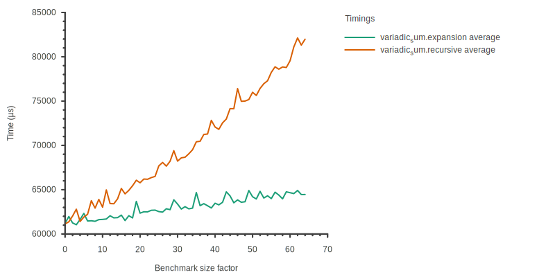
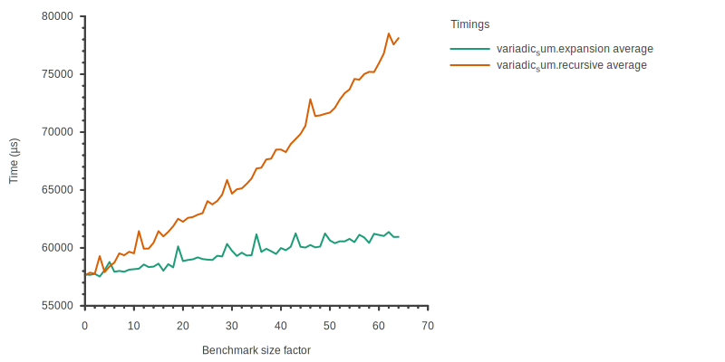

# Summary

With metaprogrammed libraries like Eigen[@eigen], Blaze[@blazelib], or
CTRE[@ctre] being developed, we're seeing increasing computing needs at compile
time. These compile-time computing needs might grow even further as C++ embeds
more features over time to support and extend this kind of practices, like
compile-time containers[@more-constexpr-containers] or static
reflection[@static-reflection].

That increase in compute needs raises the question on how to measure the impact
of metaprogramming techniques on compile times. There are a lot of tools to run
benchmarks for "runtime" programs, but as of today, only Metabench[@metabench]
is capable of running compile-time benchmarks instantiated at several sizes to
measure compile-time scaling of metaprogramming techniques. Another tool called
Templight[@templight] has debugging and profiling capabilities for templates
using Clang, although it only works as a "one-shot" profiler, which can't be
used to study how metaprograms scale. Online compile-time benchmarking tool
Build-Bench[@buildbench] is available too, but only allows simple A/B
comparisons by measuring compiler execution time.

Clang has a built-in profiler that provides in-depth time measurements of
various compilation steps, which can be enabled by passing the `-ftime-trace`
flag. Its output contains data that can be directly linked to symbols in the
source code, making it easier to study the impact of specific symbols on various
stages of compilation. The output format is a JSON file meant to be compatible
with Chrome's flame graph visualizer, that contains a series of timed events
with optional metadata like the (mangled) C++ symbol or the file related to an
event.

The events can then be visualized using tools such as Google's
[Perfetto UI](https://ui.perfetto.dev/).

# Statement of need

Originally inspired by Metabench[@metabench], ctbench development was
driven by the need for a similar tool that allows the observation of Clang's
time-trace files to help get a more comprehensive view on the impact of
metaprogramming techniques on compile times.

A strong emphasis was put on developer friendliness, project integration, and
component reusability. ctbench provides a well documented CMake API for
benchmark declaration, allows benchmark generation using the C++ pre-processor,
and its C++ core can be used as a shared C++ library as well.

The core library provides data representations to handle benchmarks cases
instantited at several sizes, each instance being repeated at least once. It
also provides tools to aggregate, filter, and sort data from time-trace events,
as well as various plotters that provide different aggregation and vizualisation
strategies. The plotters can generate files in various format thanks to the
Sciplot[@sciplot] library, and they are highly configurable through JSON
configuration files that are well documented. Default configuration files can be
generated using a dedicated CLI tool.

Even though ctbench was made to analyze Clang's time-trace events, it can also
measure compiler execution time and report it in a synthetic time-trace file,
making it partially compatible with GCC as well.

All these features make ctbench a very complete toolkit for compile-time
benchmarking, making comprehensive benchmark quick and easy, and the only
compile-time benchmarking tool that can gater Clang profiling data for scaling
analysis.

# Statement of interest

ctbench was first presented at the CPPP 2021 conference[@ctbench-cppp21] which
is the main C++ technical conference in France. It is being used to benchmark
examples from the poacher[@poacher] project, which was briefly presented at the
Meeting C++ 2022[@meetingcpp22] technical conference.

# Practical examples

Poacher is a series of experimental projects meant to help us understanding what
metaprogramming could be thanks to new C++ features such as non-transient
constexpr memory allocation[@constexpr-memory]. It helped us getting hands-on
experience on code generation using constexpr allocated memory, studying and
overcoming the roadblocks, and evaluating the compile-time impact of the
involved techniques.

We're focusing on a benchmark in Poacher where we compare two backends of the
Brainfuck metacompiler, where each one is tasked with generating code from a
constexpr AST. One of them translates the AST into an expression template,
whereas the other one serializes the AST into an array to use it as an NTTP.

Here is a first graph comparing the total compilation time between two code
generation backends:

{width=100%}

We can also compare total time spent in frontend sections:

{width=100%}

And also look at other more specific events such as the total time spent in
InstantiateFunction timers:

{width=100%}

And within this class of timers, we can segregate functions. Here, we're looking
at the time for the InstantiateFunction event specific to the run_program
function, which is the driver function for both benchmark cases:

{width=100%}

However these graphs must not be interpreted alone. It is important to look at
the hierarchy of Clang's timer events using flame graph visualizers as events
might overlap each other. Also note that the hierarchy of events can vary from a
benchmark case to another within a same benchmark category.

<!--`Gala` is an Astropy-affiliated Python package for galactic dynamics. Python
enables wrapping low-level languages (e.g., C) for speed without losing
flexibility or ease-of-use in the user-interface. The API for `Gala` was
designed to provide a class-based and user-friendly interface to fast (C or
Cython-optimized) implementations of common operations such as gravitational
potential and force evaluation, orbit integration, dynamical transformations,
and chaos indicators for nonlinear dynamics. `Gala` also relies heavily on and
interfaces well with the implementations of physical units and astronomical
coordinate systems in the `Astropy` package [@astropy] (`astropy.units` and
`astropy.coordinates`).-->

<!--`Gala` was designed to be used by both astronomical researchers and by
students in courses on gravitational dynamics or astronomy. It has already been
used in a number of scientific publications [@Pearson:2017] and has also been
used in graduate courses on Galactic dynamics to, e.g., provide interactive
visualizations of textbook material [@Binney:2008]. The combination of speed,
design, and support for Astropy functionality in `Gala` will enable exciting
scientific explorations of forthcoming data releases from the *Gaia* mission
[@gaia] by students and experts alike.-->

<!--
# Reference

## Citations

https://pandoc.org/MANUAL.html#extension-citations

## Figures

Figures can be included like this:

and referenced from text using \autoref{fig:example}.

Figure sizes can be customized by adding an optional second parameter:
{ width=20% }
-->

# Acknowledgements

We acknowledge contributions from Philippe Virouleau

# References
