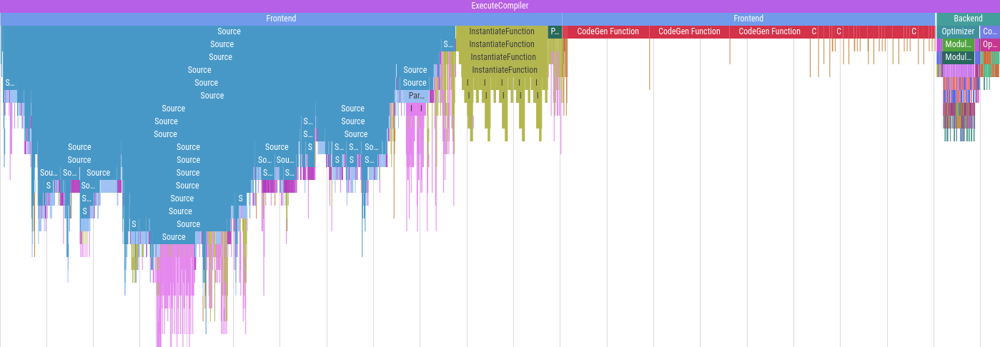

# Summary

With libraries like Eigen[@eigen], Blaze[@blazelib], or CTRE[@ctre] being
developed with a large tempalte metaprogrammed implementation, we're seeing
increasing computing needs at compile time. These needs might grow even larger
as C++ embeds more features over time to support and extend this kind of
practices, like compile-time containers[@more-constexpr-containers] or static
reflection[@static-reflection]. However, there is still no clear cut methodology
to compare the performance impact of different metaprogramming strategies. But,
as new C++ features allows for new techniques with claimed better compile-time
performance, no proper methodologies is provided to back up those claims.

This paper introduces **ctbench**, which is a set of tools for compile-time
benchmarking and analysis in C++. It aims to provide developer-friendly tools to
declare and run benchmarks, then aggregate, filter out, and plot the data to
analyze it. As such, **ctbench** is meant to become the first layer for a proper
scientific methodology for analyzing compile-time program behavior.

We'll first have a look at current tools for compile-time profiling and
benchmarking and establish the limits of current tooling, then we'll explain
what **ctbench** brings to overcome these limits.

# Statement of need

C++ template metaprogramming raised interest for allowing computing libraries to
offer great performance with a very high level of abstraction. As a tradeoff for
interpreting representations of calculations at runtime, they are represented at
compile-time, and transformed directly into their own programs.

As metaprogramming became easier with C++11 and C++17, it became more mainstream
and consequently, developers have to bear with longer compilation times without
being able to explain them. Therefore, being able to measure compilation times
is increasingly important, and being able to explain them as well. A first
generation of tools aims to tackle this issue with their own specific
methodologies:

- Buildbench[@buildbench] measures compiler execution times for basic
  A-B compile-time comparisons in a web browser,
- Metabench[@metabench] instantiates variably sized benchmarks using embedded
  Ruby (ERB) templating and plots compiler execution time, allowing scaling
  analyses of metaprograms,
- Templight[@templight] adds Clang template instantiation inspection
  capabilities with debugging and profiling tools.

Additionally, Clang has a built-in profiler[@time-trace] that provides in-depth
time measurements of various compilation steps, which can be enabled by passing
the `-ftime-trace` flag. Its output contains data that can be directly linked to
symbols in the source code, making it easier to study the impact of specific
symbols on various stages of compilation. The output format is a JSON file meant
to be compatible with Chrome's flame graph visualizer, that contains a series of
time events with optional metadata like the mangled C++ symbol or the file
related to an event. The profiling data can then be visualized using tools such
as Google's [Perfetto UI](https://ui.perfetto.dev/).

Clang's profiler data is very exhaustive and insightful, however there is no
tooling to make sense of it in the context of variable size compile-time
benchmarks. **ctbench** tries to bridge the gap by providing a tool to analyze
this valuable data. It also improves upon existing tools by providing a solution
that's easy to integrate into existing CMake projects, and generates graphs in
various formats that are trivially embeddable in documents like research papers,
web pages, or documentations. Additionally, relying on persistent configuration,
benchmark declaration and description files provides strong guarantees for
benchmark reproductibility, as opposed to web tools or interactive profilers.

# Functionality

Originally inspired by Metabench[@metabench], **ctbench** development was
driven by the need for a similar tool that allows the observation of Clang's
time-trace files to help get a more comprehensive view on the impact of
metaprogramming techniques on compile times. A strong emphasis was put on
developer friendliness, project integration, and component reusability.

**ctbench** provides:

- a well documented CMake API for benchmark declaration, which can be generated
  using the C++ pre-processor,

  Although CMake is not a proper programming language, it is used as the main
  API for **ctbench** as most C++ developers are already familiar with it.

- a set of JSON-configurable plotters with customizable data aggregation
  features, which can be reused as a C++ library

  The core library provides data representations to handle benchmarks cases
  instantiated at several sizes, each instance being repeated at least once. It
  also provides tools to aggregate, filter, and sort data from time-trace
  events, as well as various plotters that provide different aggregation and
  visualisation strategies. The plotters can generate files in various format
  thanks to the Sciplot[@sciplot] library, and they are highly configurable
  through JSON configuration files that are well documented. Default
  configuration files can be generated using a dedicated CLI tool.

Despite the fact that **ctbench** was made to handle Clang's time-trace events,
it can also measure compiler execution time and report it in a synthetic
time-trace file, making it partially compatible with GCC as well.

In addition to **ctbench**'s time-trace handling, it has a compatibility mode
for compilers that do not support it like GCC. This mode works by measuring
compiler execution time just like Metabench[@metabench] and generating a
time-trace file that contains compiler execution time. Moreover, the tooling
makes defining compilers per-target possible within a CMake project, allowing
black-box compiler performance comparisons between GCC and Clang for example or
comparisons between different versions of a compiler.

All these features make **ctbench** a very complete toolkit for compile-time
benchmarking, making comprehensive benchmark quick and easy, and the only
compile-time benchmarking tool that can gater Clang profiling data for scaling
analysis.

# Statement of interest

**ctbench** was first presented at the CPPP 2021 conference[@ctbench-cppp21]
which is the main C++ technical conference in France. It is being used to
benchmark examples from the poacher[@poacher] project, which was briefly
presented at the Meeting C++ 2022[@meetingcpp22] technical conference.

# Related projects

- [Poacher](https://github.com/jpenuchot/poacher): Experimental constexpr
  parsing and code generation for the integration of arbitrary syntax DSL in
  C++20

- [Rule of Cheese](https://github.com/jpenuchot/rule-of-cheese): A collection of
  compile-time microbenchmarks to help set better C++ metaprogramming guidelines
  to improve compile-time performance

# Acknowledgements

We acknowledge contributions from Philippe Virouleau and Paul Keir for their
insightful suggestions.

# References

