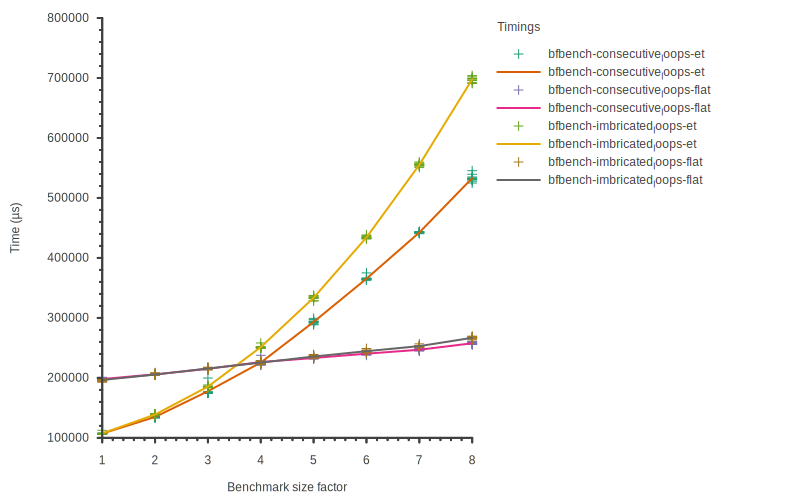

# ctbench

- Github project: https://github.com/jpenuchot/ctbench
- Online documentation: https://jpenuchot.github.io/ctbench-docs/

Set of tools for comprehensive benchmarks based on clang's time-trace feature.

`ctbench` allows you to declare and generate compile-time benchmark batches for
given ranges, run them, aggregate time-trace reports, and plot them.
This allows you to get more comprehensive data than just compiler runtime
or single-size flame graphs.

`ctbench` was made to fit the needs of **scientific data collection
and analysis**, thus it is not a one-shot profiler, but a set of tools that
allow you to get **reproductible data** from user-defined compile-time
benchmarks.

It has two main components: a CMake boilerplate library and a C++ plotting
toolset.

The CMake library contains all the boilerplate code to define benchmark targets
compatible with the C++ plotting toolset called `grapher`.

[Rule of Cheese](https://github.com/jpenuchot/rule-of-cheese) can be used as a
reference project for using ctbench.

## Using ctbench

### Installing ctbench

```sh
git clone https://github.com/jpenuchot/ctbench
cd ctbench
cmake --preset release
cmake --build --preset release
sudo cmake --build --preset release --target install
```

### Integrating ctbench in your project

Use `find_package(ctbench REQUIRED)` after installing it.

The [Rule of Cheese](https://github.com/JPenuchot/rule-of-cheese) project can be
used as an example of how to use `ctbench`. It is the project that gave birth to
this tool and is maintained as `ctbench` evolves.

You may refer to the [CMake API reference](generated-docs/ctbench-api.md) for
more details.

### Declaring a benchmark case target

A benchmark case is represented by a C++ file. It will be "instanciated", ie.
compiled with `BENCHMARK_SIZE` defined to values in a range that you provide.

`BENCHMARK_SIZE` is intended to be used by the preprocessor to generate a
benchmark instance of the desired size:

```cpp
#include <boost/preprocessor/repetition/repeat.hpp>

// First we generate foo<int>().
// foo<int>() uses C++20 requirements to dispatch function calls accross 16
// of its instances, according to the value of its integer template parameter.

#define FOO_MAX 16

#define DECL(z, i, nope)                                                       \
  template <int N>                                                             \
  requires(N % FOO_MAX == i) constexpr int foo() { return N * i; }

BOOST_PP_REPEAT(BENCHMARK_SIZE, DECL, FOO_MAX);
#undef DECL

// Now we generate the sum() function for instanciation

int sum() {
  int i;

#define CALL(z, n, nop) i += foo<n>();
  BOOST_PP_REPEAT(BENCHMARK_SIZE, CALL, i);
#undef CALL
  return i;
}
```

By default, only compiler execution time is measured.
If you want to generate plots using Clang's builtin profiler, add the following:

```cmake
add_compile_options(-ftime-trace -ftime-trace-granularity=1)
```

Note that plotting profiler data takes more time
and will generate a *lot* of plot files.

Then you can declare a benchmark case target in CMake with the following:

```cmake
ctbench_add_benchmark(function_selection.requires # Benchmark case name
  function_selection-requires.cpp                 # Benchmark case file
  1                                               # Range begin
  32                                              # Range end
  1                                               # Range step
  10)                                             # Iterations per size
```

### Declaring a graph target

Once you have several benchmark cases, you can start writing a graph config.

Example configs can be found [here](
https://github.com/JPenuchot/ctbench/tree/main/grapher/configs), or by running
`ctbench-grapher-utils --plotter=<plotter> --command=get-default-config`. A list
of available plotters can be retrieved by running
`ctbench-grapher-utils --help`.

```json
{
  "plotter": "compare_by",
  "demangle": true,
  "draw_average": true,
  "draw_points": true,
  "key_ptrs": [
    "/name",
    "/args/detail"
  ],
  "legend_title": "Timings",
  "plot_file_extensions": [
    ".svg",
    ".png"
  ],
  "value_ptr": "/dur",
  "width": 1500,
  "height": 500,
  "x_label": "Benchmark size factor",
  "y_label": "Time (µs)"
}
```

This configuration uses the `compare_by` plotter. It compares features targeted
by the JSON pointers in `key_ptrs` across all benchmark cases. This is the
easiest way to extract and compare as many time-trace features at once.

Back to CMake, you can now declare a graph target using this config to compare
the time spent in the compiler execution, the frontend, and the backend between
the benchmark cases you declared previously:

```cmake
ctbench_add_graph(function_selection-feature_comparison-graph # Target name
  ${CONFIGS}/feature_comparison.json                          # Config
  function_selection.enable_if                                # First case
  function_selection.enable_if_t                              # Second case
  function_selection.if_constexpr                             # ...
  function_selection.control
  function_selection.requires)
```

For each group descriptor, a graph will be generated with one curve
per benchmark case. In this case, you would then get 3 graphs
(`ExecuteCompiler`, `Frontend`, and `Backend`) each with 5 curves (`enable_if`,
`enable_if_t`, `if_constexpr`, `control`, and `requires`).

### Examples


**Clang ExecuteCompiler time curve from
[poacher](https://github.com/jpenuchot/poacher),
generated by the *compare_by* plotter**



**Clang InstantiateFunction time curve from
[poacher](https://github.com/jpenuchot/poacher),
generated by the *compare_by* plotter**

## Additional

- [ctbench: compile time benchmarking for Clang](
  https://www.youtube.com/watch?v=1RZY6skM0Rc) at [CPPP 2021](
  https://cppp.fr/schedule2021/)
- [Pyperf - Tune the system for benchmarks](
  https://pyperf.readthedocs.io/en/latest/system.html)
- [A totally constexpr standard library - Paul Keir, Joel Falcou et al - Meeting C++ 2022](
  https://www.youtube.com/watch?v=ekFPm7e__vI)
